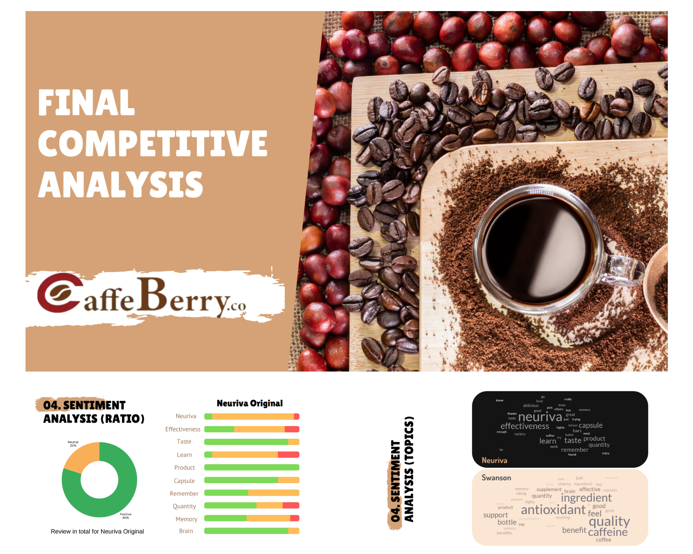

# Portfolio

## *If you prefer resume format* [click here](pdf/LongPham_Resume.pdf)

---

## A. Work Projects

### [1. Industrial and Sentiment Analysis (Python Project)](https://github.com/longkun158/CoffeeCherry)

**Project Goals**

- Scrape Data from iherb.com/ca about competitor products of Coffee Cherry using Beautiful Soup and Selenium to prepare for analysis.
- Performed sentiment analysis using Natural Language Processing techniques and machine learning models from NLTK and Hugging Face, leading to the development of 4 comprehensive competitor profiles to support the company’s strategic planning.

**Delivery**
  
[Presentation with Canva slides](/pdf/Caffe_Berry_Business_Analysis.pdf)

---
### [2. Business Analysis (Python Project)](https://github.com/longkun158/Data-Taxi-Operation)

**Project Goals**

- Conducted exploratory data analysis on a dataset of 1.2 million rows to provide strategic recommendations for a New York-based taxi company, supporting data-driven decision-making.
- Analyzed customer behavior and identified key patterns and trends using statistical tests, including chi-square, ANOVA, Tukey's HSD, and Dunn's post-hoc tests, to enhance business insights.
- Presented actionable insights and recommendations through compelling visualizations and an engaging Canva presentation, tailored for stakeholders.

**Delivery**
  
[Canva Slide](/pdf/Taxi_Operation.pdf) 

---

## B. School Projects

### [1. Health Survey Questions Analysis (R-RStudio Project)](https://github.com/longkun158/HealthQuestion)

**Project Goals**

- Analyzed differences between body types and diet types on physical and mental health scales, revealing distinct patterns by body type. Presented findings with relevant visualizations for clarity.
- Applied Principal Component Analysis (PCA) to visually distinguish group responses and used Factor Analysis to identify two key latent factors for mental health and social connection, providing insights into health perceptions associated with each body type.

**Delivery**
 
[PDF Markdown File](pdf/Health-Analysis.pdf)

### [2. Understanding Wildfire patterns (R-RStudio Project)](https://github.com/longkun158/HealthQuestion)

**Project Goals**

- Using Exploratory Data Analysis to find relationships between different technical variables of a wildfire data set.
- Finding trends and patterns to predict in average hectares wildfires happen throughout a year.
- Created a story to present in a poster to educate about wildfires.

**Delivery**
 
[Poster and PDF Markdown File](pdf/Understand_Wildefire.pdf)

---

---
