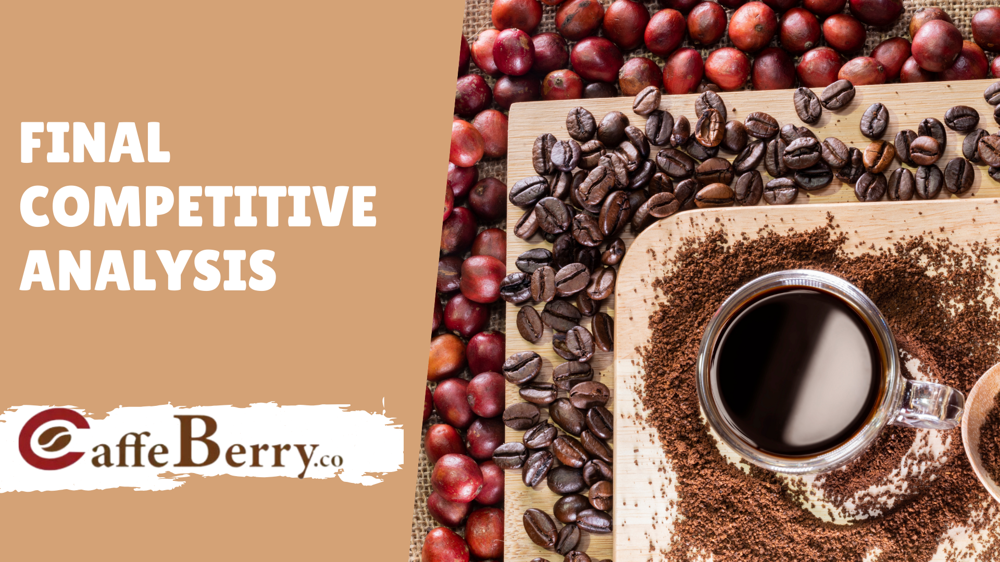

# Portfolio

---

## Work Projects

### [Industrial and Sentiment Analysis](/pdf/Caffe_Berry_Business_Analysis.pdf)

---
### [Business Analysis](/pdf/Taxi_Operation.pdf) 

---

### School Projects

- [Health Survey Questions Analysis](http://example.com/)
- [Project 2 Title](http://example.com/)
- [Project 3 Title](http://example.com/)
- [Project 4 Title](http://example.com/)
- [Project 5 Title](http://example.com/)

---

---

Page template forked from <a href="https://github.com/evanca/quick-portfolio">evanca</a>

<!-- Remove above link if you don't want to attibute -->
